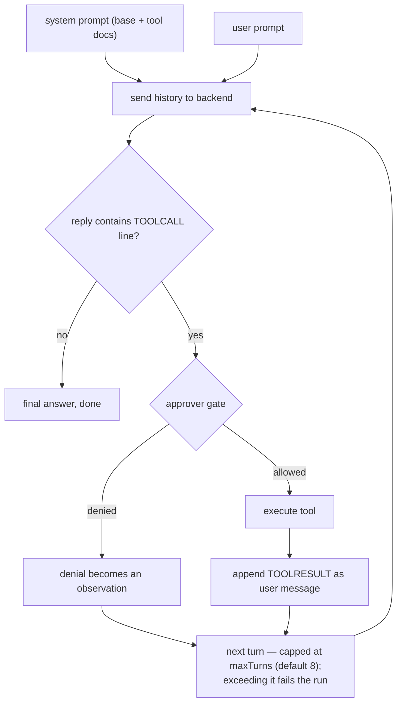
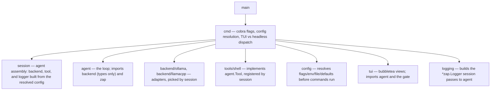

# go-reins

A minimal AI agent harness written in Go. It is a learning project for
understanding how agent tooling is built: a small agent loop that talks to
local inference backends (Ollama, llama.cpp) through a swappable interface.

## Agent vs. harness

- **Agent** — the LLM in a loop that decides what to do next (reason, act,
  observe, repeat).
- **Harness** — the scaffolding around it: tools, backend plumbing,
  configuration, and (later) permissions and context management.

This project implements both, with a strict seam between them.

## Architecture

```
go-reins/
├── main.go                        # entry point, just calls cmd.Execute()
├── cmd/
│   ├── root.go                    # cobra root + flag registration
│   ├── run.go                     # `go-reins run "task"`: TUI or headless
│   └── chat.go                    # `go-reins chat`: interactive REPL
└── internal/
    ├── backend/
    │   ├── backend.go             # the Backend interface — the swappable seam
    │   ├── ollama/ollama.go       # adapter: native /api/chat
    │   └── llamacpp/llamacpp.go   # adapter: OpenAI-style /v1/chat/completions
    ├── tools/
    │   └── shell/shell.go         # tool: run a shell command, return its output
    ├── config/
    │   └── config.go              # flags > env (GO_REINS_*) > YAML file > defaults
    ├── session/
    │   └── session.go             # agent assembly: backend + tool + logger from config
    ├── tui/
    │   ├── approval.go            # ApprovalGate: sync Approver <-> bubbletea bridge
    │   ├── run.go                 # run view: spinner, approval dialog, answer
    │   ├── chat.go                # chat REPL: transcript, input, approvals
    │   └── styles.go              # shared lipgloss styles
    ├── logging/
    │   └── logging.go             # zap logger setup, level from --log-level
    └── agent/
        └── agent.go               # the agent loop + Tool and Approver interfaces
```

Key design decisions:

- **`internal/backend.Backend`** is the only contract the rest of the code
  relies on. Ollama and llama.cpp are two adapters over one three-method
  interface (`Name`, `Chat`). Adding a cloud API later means writing one new
  package — nothing else changes.
- **`internal/agent`** runs a reason → act → observe loop with a
  configurable turn cap (`WithMaxTurns`). Tool calling uses a text
  protocol owned by the agent: registered tools are announced in the
  system prompt, the model requests one with a `TOOLCALL <name>
  <json>` line, and the observation returns as a `TOOLRESULT` user
  message. Tool errors and unknown tools become observations, so the
  model can recover instead of the run failing. `Run` reports how many
  turns it used and returns the full conversation history for review
  (`RunResult`); `go-reins run` prints the turn count and offers
  `--history` to dump the transcript.
- **Human in the loop**: an `Approver` gate shows every tool call
  before execution. In a terminal, the bubbletea views (`internal/tui`)
  present each call as an approval dialog (`y`/`n`) unless `--yes` is
  set; without a TTY, `go-reins run` falls back to a plain `y/N` prompt
  on stdin. A denied call is fed back to the model as an observation.
- **Interaction** runs on bubbletea (`internal/tui`). The trick the
  seams allow: `Approver` is a synchronous callback invoked from inside
  the agent loop, while bubbletea owns the terminal. The `ApprovalGate`
  bridges them with channels — the approver blocks on a request
  channel, the TUI delivers the operator's decision on a reply channel.
  The agent package never learns that a TUI exists.
- **`internal/tools/shell`** runs a command via `sh -c` with a 30s
  timeout and caps its output, so the agent can inspect the machine
  it runs on ("figure out which system you run on"). A non-zero exit
  status is an observation, not a failure.
- **Configuration** lives in `internal/config` with an explicit
  precedence chain: CLI flags > environment (`GO_REINS_*`) > config
  file (YAML) > defaults. A flag only wins when it was explicitly
  set, so a config file or env var can supply what the user left at
  its default. (This used to be viper's job; the hand-rolled version
  is ~200 lines and keeps the dependency tree small.)
- **Logging** uses zap (`internal/logging`): one logger per run,
  console format on stderr, level via `--log-level`. The agent logs
  turns at debug, tool calls at info, and denials/failures at warn;
  stdout stays reserved for the answer.

### Component seams

Every extension point is a small interface with one implementation
per variant. The agent package depends on none of the concrete
implementations — `session` wires them together:

| Seam | Interface | Implementations |
| --- | --- | --- |
| Inference | `backend.Backend` | `ollama`, `llamacpp` |
| Capability | `agent.Tool` | `tools/shell` |
| Permission | `agent.Approver` | `tui.ApprovalGate` (bubbletea), stdin prompt (headless), nil = allow |
| Observability | `*zap.Logger` | `internal/logging` (no-op default) |
| Presentation | — (owns the terminal) | `tui` run view, `tui` chat REPL |
| Configuration | `config.Config` | `internal/config` (flags/env/file/defaults) |

### The agent loop

One `Run` is a bounded loop of backend round trips ("turns"). The
model's reply decides how each turn ends:



Deliberate loop properties:

- **Errors are observations, not crashes.** Unknown tools, tool
  failures, and denied calls are fed back as `TOOLRESULT` text so the
  model can recover — retry, pick another path, or answer without the
  tool. The run itself only fails on backend errors or exhausting
  `maxTurns`.
- **The protocol is text, not native tool calling.** The agent owns
  the `TOOLCALL`/`TOOLRESULT` convention, so backends stay dumb
  message-in/message-out adapters and the same loop works on any
  model that can follow prompt instructions. The trade-off: small
  models may break the format. Native calling (Ollama `tools`,
  OpenAI `tool_calls`) is a possible later step; it would live in the
  adapters and extend `backend.ChatRequest`/`ChatResponse`.
- **One tool call per turn.** The first `TOOLCALL` line in a reply is
  executed; the reply is otherwise treated as final. Multi-call and
  parallel execution are left open deliberately.
- **`Run` is stateless.** History lives for the duration of the call
  and is returned in `RunResult` for review; calling `Run` twice never
  shares state. `Step` is the session variant: it takes an existing
  history and returns the extended one, so the chat REPL can carry
  the conversation across prompts while each step still gets its own
  turn budget.

### Package dependencies



Dependencies point inward: `agent` knows only the `backend.Backend`
interface and its message types — never which adapter is behind it,
and never a concrete tool. `session` is the only place that assembles
concrete implementations, which is what keeps the seams swappable.

## Requirements

- Go 1.27 or later
- A running [Ollama](https://ollama.com) server (default
  `http://localhost:11434`) or a llama.cpp server (`llama-server`, default
  `http://localhost:8080`)

## Build

```sh
go build -o go-reins .
```

## Usage

Run a single task through the agent:

```sh
./go-reins run --model llama3.2 "explain the CAP theorem in 3 sentences"
```

Give it a task that needs the machine (each tool call prompts for
confirmation unless `--yes` is set):

```sh
./go-reins run --model llama3.2 "figure out which system you run on"
```

Use the llama.cpp backend:

```sh
./go-reins run --backend llamacpp --model qwen2.5 "hello"
```

Start an interactive chat session (transcript, input area, approval
dialogs; conversation persists for the session, quit with ctrl+c):

```sh
./go-reins chat --model llama3.2
```

In a terminal both commands run their bubbletea views. Piped into
something else, `run` falls back to plain output and a `y/N` prompt on
stdin, so it stays scriptable; `chat` requires a terminal.

List the open source licenses of everything the binary links
against:

```sh
./go-reins licenses
```

Modules and versions come from the build info embedded in the
binary; license texts are read from the local Go module cache and
classified against common SPDX signatures (`internal/licenses`).

### Flags and configuration

| Flag | Env | Default | Description |
| --- | --- | --- | --- |
| `--backend` | `GO_REINS_BACKEND` | `ollama` | `ollama` or `llamacpp` |
| `--model` | `GO_REINS_MODEL` | — | model name, e.g. `llama3.2` |
| `--url` | `GO_REINS_URL` | per-backend default | backend base URL |
| `--yes` | `GO_REINS_YES` | `false` | auto-approve tool calls (no confirmation prompt) |
| `--history` | `GO_REINS_HISTORY` | `false` | print the full conversation after the answer |
| `--turns` | `GO_REINS_TURNS` | `false` | print how many turns the run took |
| `--log-level` | `GO_REINS_LOG_LEVEL` | `error` | log level: `debug`, `info`, `warn`, `error` (stderr) |
| `--config` | — | `$HOME/.go-reins.yaml` | config file path |

Configuration resolves as CLI flags > environment (`GO_REINS_*`) >
config file > defaults; a flag counts only when explicitly set.
`internal/config` implements the whole chain — no viper.

Config file example (`~/.go-reins.yaml`):

```yaml
backend: ollama
model: llama3.2
url: http://localhost:11434
```

## Tests

```sh
go test ./...
```

Tests cover the agent loop (against a fake backend) and both adapters
(against `httptest` mock servers), so no running backend is needed.
CI ([`.github/workflows/ci.yml`](.github/workflows/ci.yml)) runs
`go vet`, `go build`, and `go test` on every push and pull request,
using the Go version pinned in `go.mod`.

## Roadmap

- [x] Tool calling: text protocol (`TOOLCALL`/`TOOLRESULT`), dispatch
      to `Tool.Execute`, observations appended to the history
- [x] Shell tool + human in the loop: tool calls shown for
      confirmation unless `--yes` is set
- [x] Bubbletea front end: run view with approval dialog, interactive
      chat REPL (`go-reins chat`), headless fallback for non-TTY use
- [x] Hand-rolled config loader replacing viper (cobra stays)
- [ ] `--max-turns` flag
- [ ] Streaming responses
- [ ] More backends (OpenAI-compatible cloud APIs)
